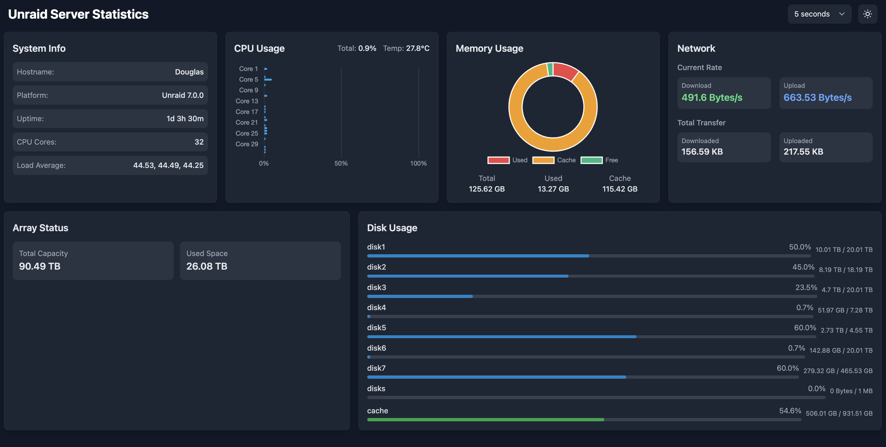

# Unraid Server Statistics Viewer

A lightweight, real-time system monitoring dashboard for Unraid servers. This application provides a clean, modern interface to view essential server statistics including CPU usage, memory utilization, network activity, and disk usage.



## Features

- 🖥️ **Real-time System Monitoring**
  - CPU usage per core with temperature
  - Memory usage with cache statistics
  - Network transfer rates and total usage
  - Array status and disk usage

- 🎨 **Modern UI**
  - Clean, responsive design
  - Dark/Light mode support
  - Configurable refresh rates
  - Mobile-friendly interface

- 📊 **Interactive Charts**
  - CPU usage bar chart
  - Memory usage doughnut chart
  - Real-time updates

## Installation

### Using Docker

1. Install the container from Unraid's Apps page or use the following Docker command:

```bash
docker run -d \
  --name=unraid-stats \
  -p 8085:8085 \
  -v /proc:/host/proc:ro \
  -v /sys:/host/sys:ro \
  -v /var/local/emhttp:/host/var/local/emhttp:ro \
  -v /var/run/mdstat:/var/run/mdstat:ro \
  -v /mnt:/host/mnt:ro \
  --restart unless-stopped \
  xexsolutions/unraid-stats
```

### Unraid Template

The container is available in Community Applications (CA) for easy installation.

## Usage

1. Access the dashboard at `http://your-server-ip:8085`
2. Select your preferred refresh rate from the dropdown menu
3. Toggle between dark and light modes using the theme button

## Development

To build and run locally:

```bash
git clone https://github.com/XeXSolutions/unraid-stats.git
cd unraid-stats
go build
./unraid-stats
```

## Contributing

Contributions are welcome! Please feel free to submit a Pull Request.

## License

This project is licensed under the MIT License - see the [LICENSE](LICENSE) file for details.

## Support

If you encounter any issues or have suggestions, please [open an issue](https://github.com/XeXSolutions/unraid-stats/issues) on GitHub.

## Acknowledgments

- Built with Go for backend services
- Frontend using Tailwind CSS and Chart.js
- Designed specifically for Unraid servers 